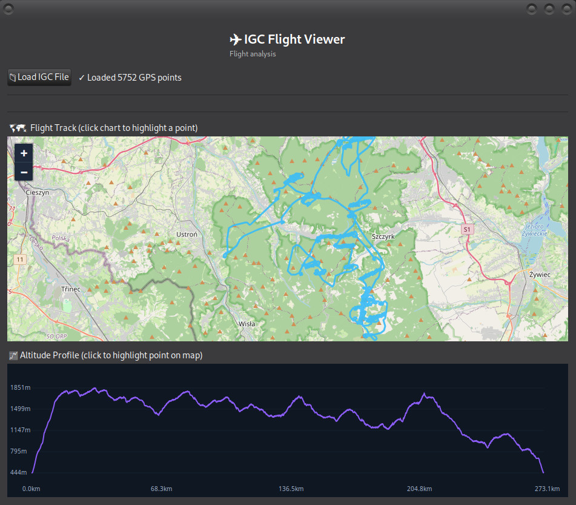

# IGC Flight Viewer

Native Linux desktop application for viewing and analyzing `.IGC` glider flight logs.



Built with:
- C++17
- GTK3
- Cairo
- WebKitGTK
- Leaflet + OpenStreetMap

## Features

- interactive flight map
- altitude profile chart
- flight statistics
- thermal climb analysis
- max speed / altitude detection
- linked chart ↔ map highlighting
- native GTK interface

Supports standard IGC files used in:
- gliders
- sailplanes
- paragliders
- soaring competitions

## Build Dependencies

Debian / Ubuntu:

```bash
sudo apt install build-essential pkg-config libgtk-3-dev libwebkit2gtk-4.0-dev
````

## Compile

```bash
./GCompileAndPack.sh
```

## Run

```bash
./igc_viewer
```


